# Lab 4 report

**PB24111630 黄雯佩**

## 一，实验目的与内容
1. 了解RAM和BRAM，以及IP核；了解存储器的性能和资源使用情况
2. 设计一个队列，应用有限状态机
3. 用verilog写一个冒泡排序

## 二，逻辑设计
##### week1
1. 如果存在状态机，请绘制出状态机的状态转换图 
   **week1**
   

      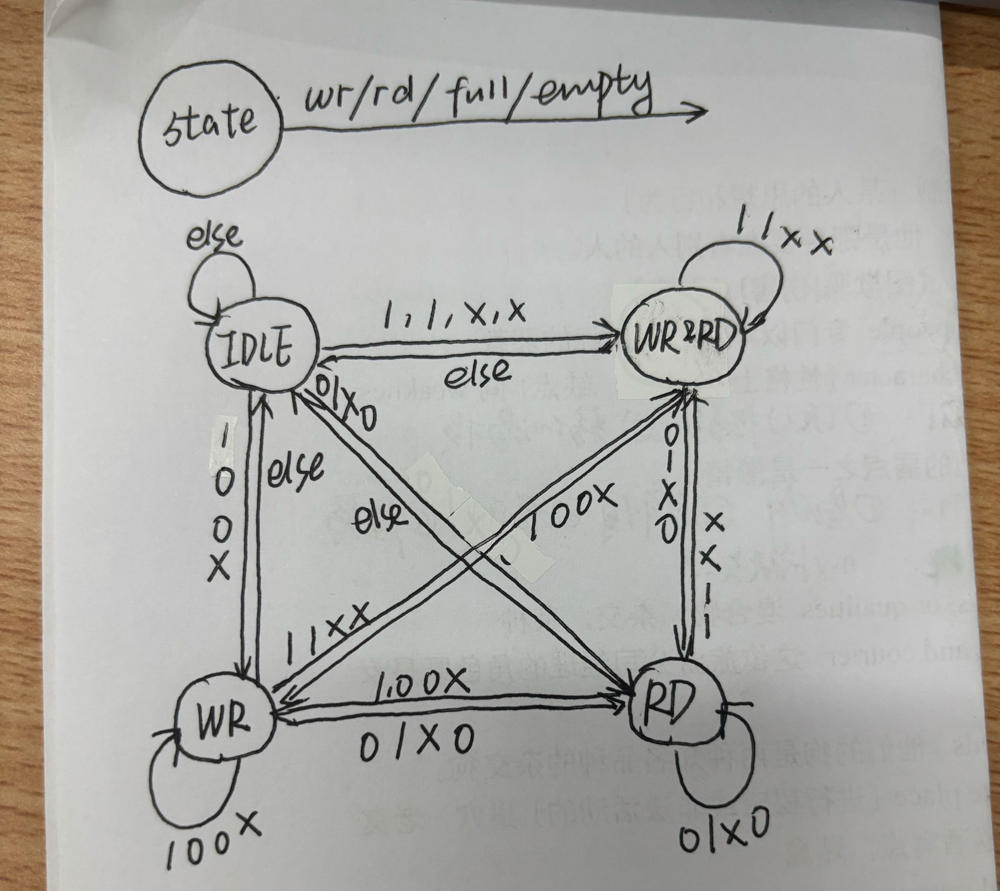
   

   
   **week2**
   

      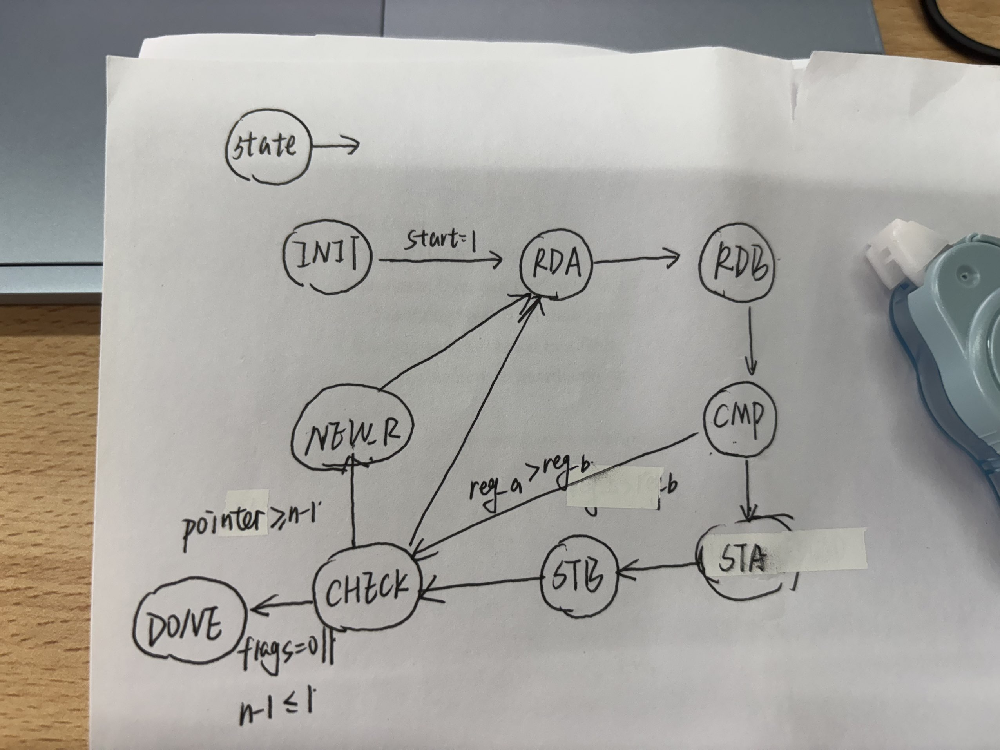
   

2. 请贴出你认为较为核心的代码以及自己有两点的设计代码，并加以解释说明。 
    **week1**
   

      
   

   RF 接受信号，写入或读出，单纯的深度为16的存储器
   

      
   

   

      
   

   FSM三段式状态机，应该是三段吧，第一段时序逻辑负责状态转移；第二段组合逻辑确定next state；第三段时序逻辑生成写使能信号wren和头/尾指针增加信号inc_front、inc_rear，好像突然懂为什么仿真的时候dout延迟一个周期了！
   

      
   

   POINTER，计数，生成头尾指针地址&empty、full信号
   **week2**
   

      
   

   CHECK_ROUND进行判断临界条件，得出下一状态
   

      
   

   若未比较数据小于2个或者一轮比较无交换，比较结束
   

      
   

   组合逻辑控制BRAM接口

## 三，仿真结果与分析

1. 请给出你使用的仿真文件的运行结果截图，并对结果加以阐释 
   **week1(RAM&BRAM)**
   

      
   

   只读，验证初始化，
   

      
   

   只写
   

      
   

   同时读写 
   **week1(FIF0)**
   

      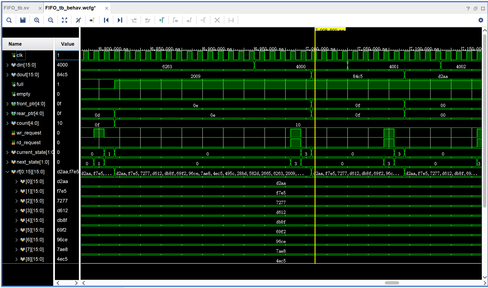
   

   

      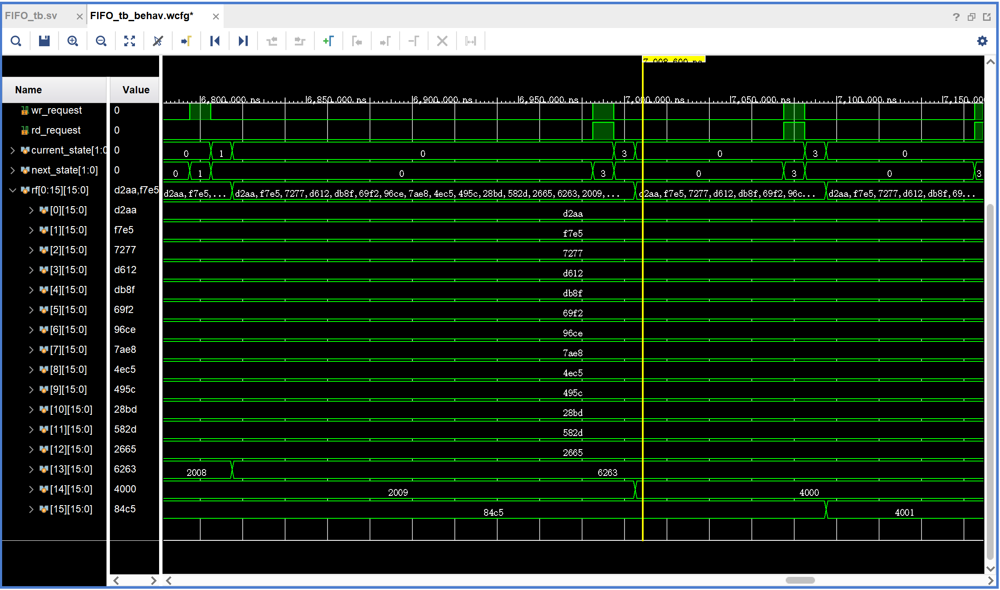
   

   读写信号同时有效时，读优先，队列仍满
   

      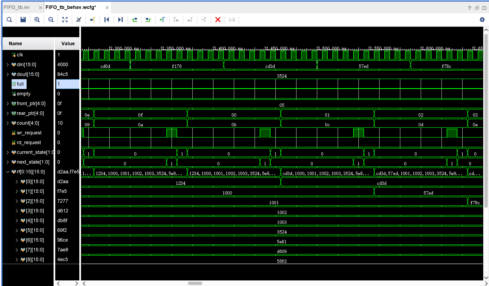
   

   count丝滑的从10(16)变成了00(0) 
   **week2**
   

      
   

   a>b时，跳过4、5状态
   

      
   

   完成一轮比较后，轮次加一
   

      
   

   1024个数太多了，用前六个数据仿真，在第三轮后不再交换，排序提前结束
2. 请贴出你编写的有特点的仿真测试文件，并说明你在编写仿真测试文件时，对各类情况的考虑（选做）。 
   **week1(RAM&BRAM)**
   

      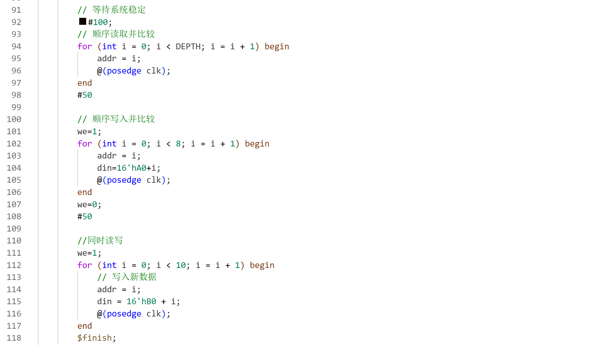
   

   **week1**
   

      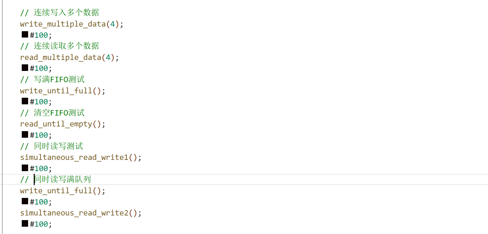
   

   第一次用task仿真，挺好用的，先空队列情况下同时读写，再满队列同时读写 
   
   **week2**
   

      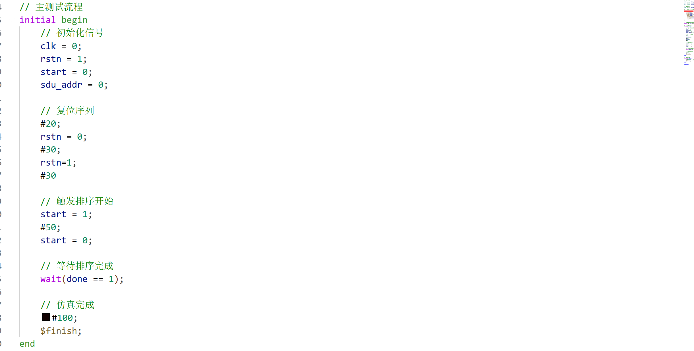
   

   好像开始就可以了
## 四，电路设计与分析
1. 请给出完整的RTL电路图。若某模块较为复杂，也可以再给出该模块的RTL电路图； 
   **week1**
   

      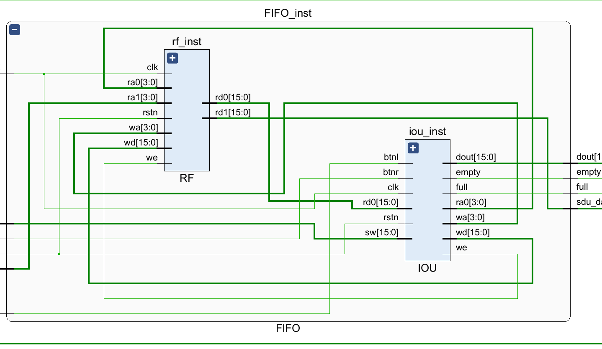
   

   

      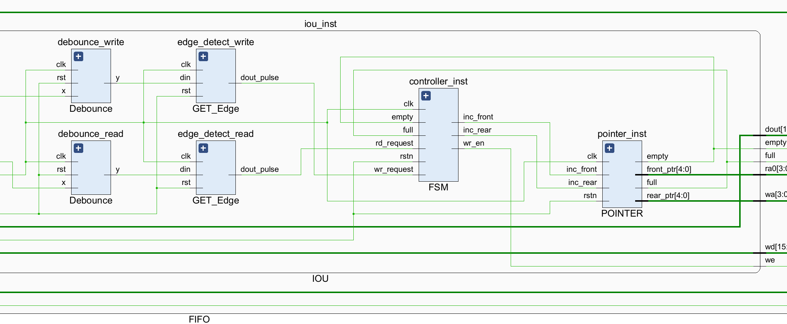
   

   
   **week2**
   

      
   

   a>b时，跳过4、5状态
   

      
   

2. 查看并在此附上资源使用情况，并截图证明WNS为非负数。 
    **week1**
    

      
   

   

      
   

   
   **week2**
   

      
   

   a>b时，跳过4、5状态
   

      
   

## 五，测试结果与分析

1. 请拍照并附上实验上板结果，以佐证设计的正确性； 
   **week1**
   

      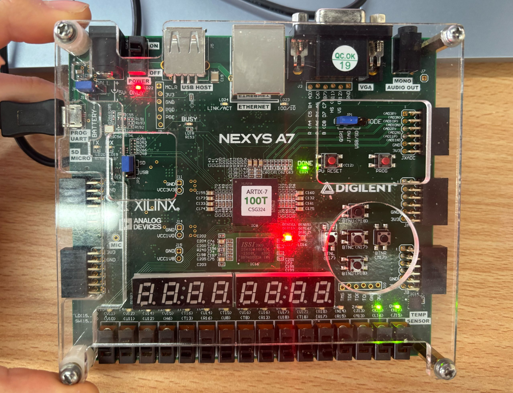
   

   

      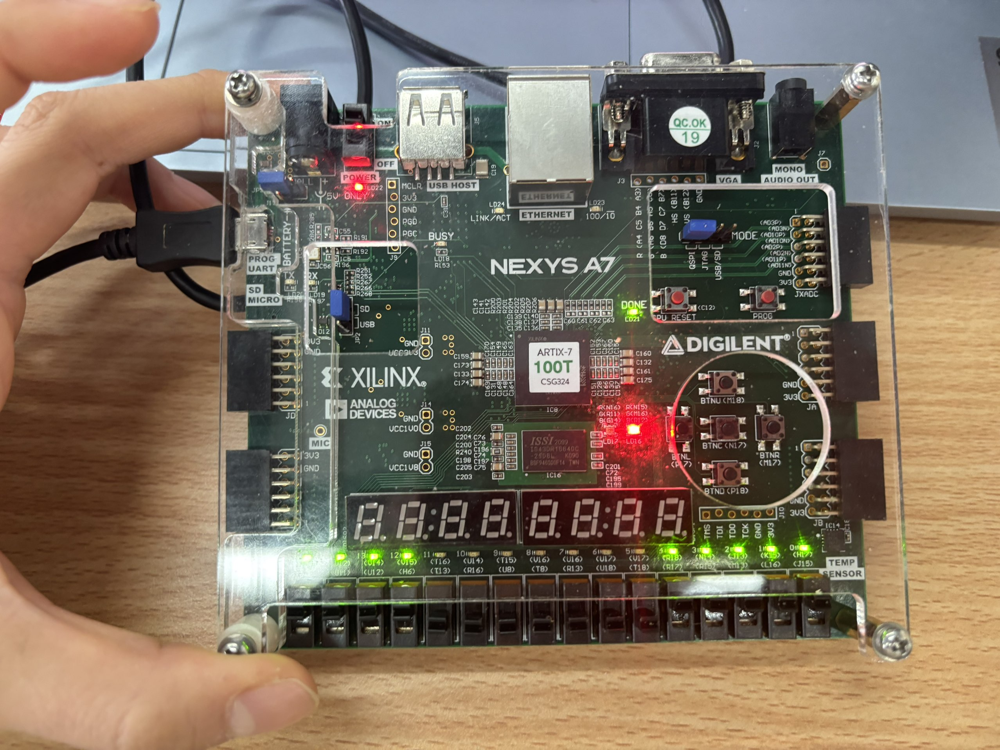
   

   

      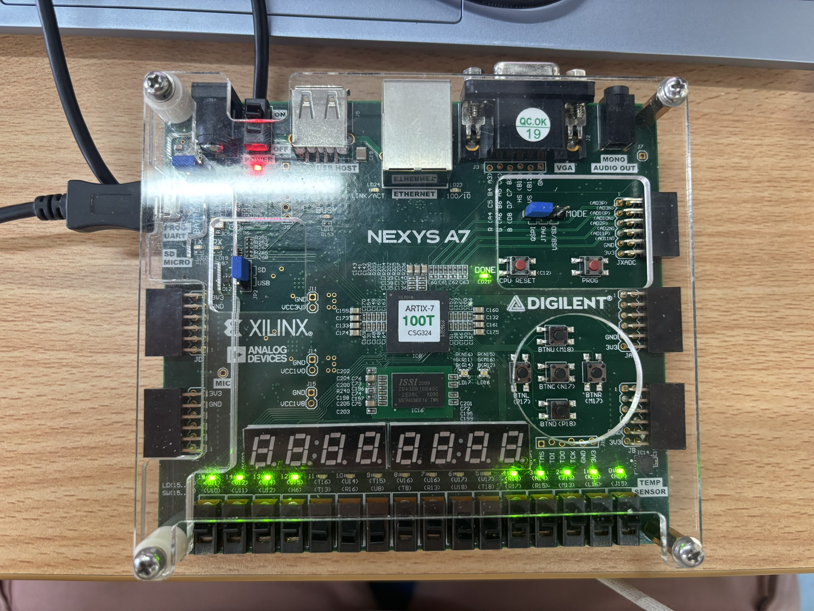
   

   
   **week2**
   

      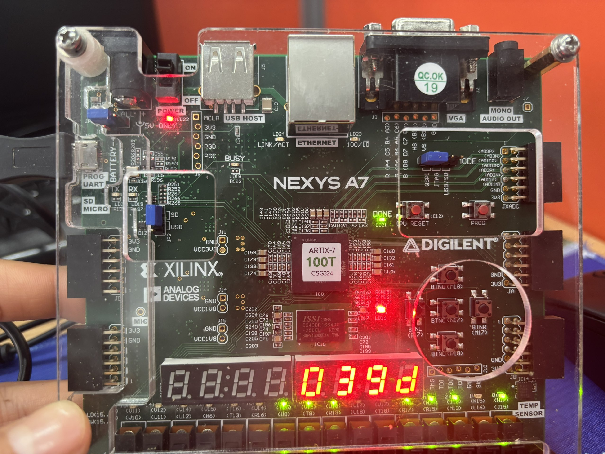
   

   
2. 对实验上板结果进行简要的说明。 
   **week1** 
   满状态指示灯led16亮，空状态指示灯led17亮 
   led0-15显示头指针指向的储存器的内容 
   **week2** 
   led16用来显示排序完成，led0-15显示轮次数 

## 总结

1. 请对本次实验中你完成的任务进行简要总结，并总结自己的收获和体验； 
   才知道仿真可以保存设定，不用每次都把一个个模块的变量输出来o(╥﹏╥)o
2. 如果对本次实验的设计或助教、老师有建议，可以在这里写下，助教和老师会认真阅读并讨论哦！