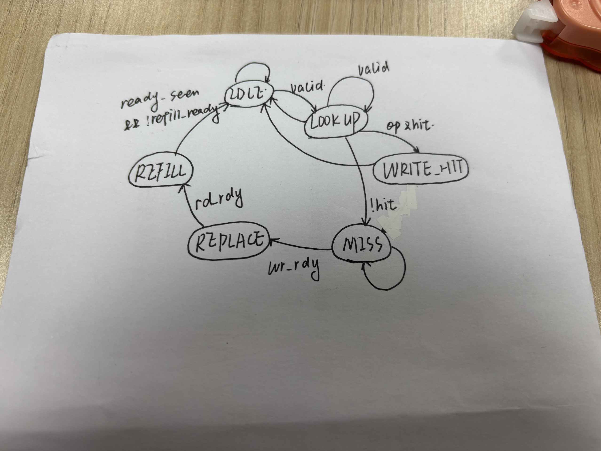
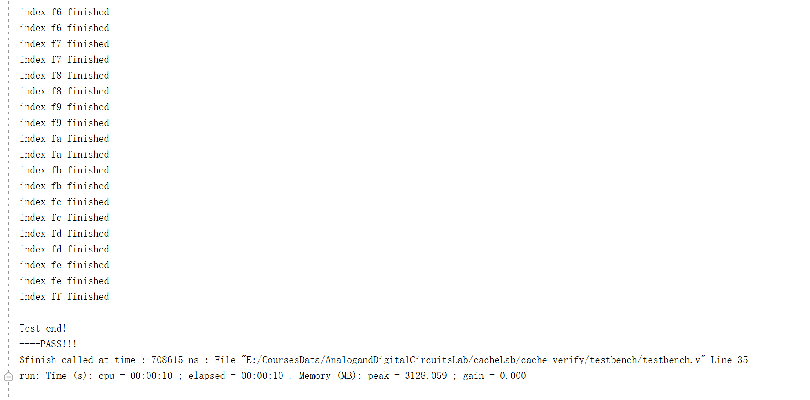
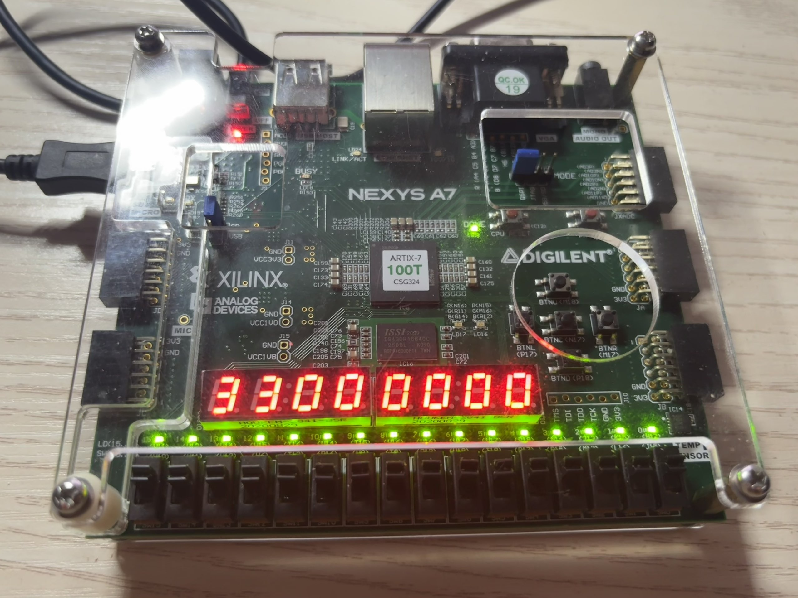
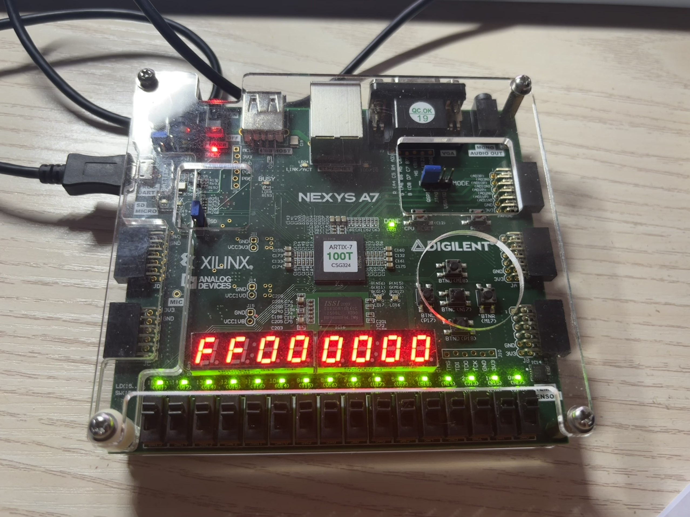

# Lab 5 report

**PB24111630 黄雯佩**

## 实验目的与内容

1. 请用自己的语言简述本次实验做的内容以及本次实验的目的，不要照抄实验PPT哦！ 
   （1）了解cache的原理、工作机制 
   （2）增强调整时序的能力 
   （3）增强仿真看波形图的能力 

## 逻辑设计

1. 如果存在状态机，请绘制出状态机的状态转换图； 
   

      
   

2. 请贴出你认为较为核心的代码以及自己有两点的设计代码，并加以解释说明。 
   

      
   

   

      
   

   refill_ready置1后空转一个周期，等数据进入WBUFFER 
   

      
   

   读取来自内存的数据并合并为cache行

## 仿真结果与分析

1. 请给出你使用的仿真文件的运行结果截图，并对结果加以阐释； 
   

      
   

   pass!!!
2. 请贴出你编写的有特点的仿真测试文件，并说明你在编写仿真测试文件时，对各类情况的考虑（选做）。 
   多亏助教给了仿真文件

## 电路设计与分析

1. 请给出完整的RTL电路图。若某模块较为复杂，也可以再给出该模块的RTL电路图； 
   

      
   

   

      
   

   

      
   

   

      
   

2. 查看并在此附上资源使用情况，并截图证明WNS为非负数。 
   

      
   

   

      
   

## 测试结果与分析

1. 请拍照并附上实验上板结果，以佐证设计的正确性； 
   

      
   

   

      
   

2. 对实验上板结果进行简要的说明。 
   复位后从七段数码管前两位从00-ff后停止

## 总结

1. 请对本次实验中你完成的任务进行简要总结，并总结自己的收获和体验； 
   上周四搞完的，那几天满脑子cachecache的，果然隔了一个周末就记不住什么了,连着搞了三天晚上，真是没debug过这么多，虽然到底也没弄清楚怎么能保存每次打开的仿真波形图窗口，可是看了n次index 00failed什么replace不对后，看到那个pass太感动了，真的纯靠自己发现不用ai修改了好多bug啊，一下子有自己是计算机专业的学生的感觉了 
   好像每次实验都是这样哎，做之前做的时候一头雾水，动不动要琢磨好久需要哪些模块，可是一旦鼓捣出来了，又发现就这么回事了 
   每次到跨年的时候，都怪感慨的哎，为什么要报这个提高班呢？觉得对专业方向不了解，想体验一下硬件吧，翻了翻聊天记录，发现是觉得这是一个参加比赛的机会，乐，当时问了助教和一个学长，感觉是不太建议的样子，不过还是想试试吧ddl之前报了，报完之后才去看评课社区，看着说一周动不动就要花七八个小时吓一跳，想着周末估计要搭上了，结果呢；最初的目的达到了吗？没有吧，一开始担心自己跟不上还听得挺认真的，后来忙起来周四去了也是去debug，第三次开始就没再听哎，看着不少同学做附加实验，想做又无力的感觉，不太好受的，十月份十一月份确实好忙，虽然不少程度上是忙着玩哎，确实发现自己没有做附加实验或者自己研究的精力了，不过还是没有太大的动力去鼓捣吧，毕竟这学期基本上都是周末不干啥，周一开始赶ddl赶到周四下午结束o(╥﹏╥)o，因此想想最初的目的是没了，并没有接触到多少硬件的东西，感觉自己的能力也不适合去打比赛什么的。可是，要是再选一次，还会这样选吧，虽然花了好多时间，好像也没有收获什么，但是总觉得真的体验到了，虽说具体体验到了什么也说不清楚，可是每次最后鼓捣出来的那一下子真的好爽好快乐好有成就感，或许体验到了怎么让FPGA按照我的意愿工作吧。下学期还有没有这个班不知道哎，会不会再去报也不知道的样子，哎好是想上的又感觉不太有性价比的滋味。 
   想想真的说不出来一般一周要花多久哎，估摸一下七八个小时？基本上都是周三周四搞的。 
   这学期也是结束啦，希望能有一个好好的结果吧
2. 如果对本次实验的设计或助教、老师有建议，可以在这里写下，助教和老师会认真阅读并讨论哦！ 
   助教伟大！！！非常及时得回复了我的好多问题，还有几次凌晨秒回我，太感动了