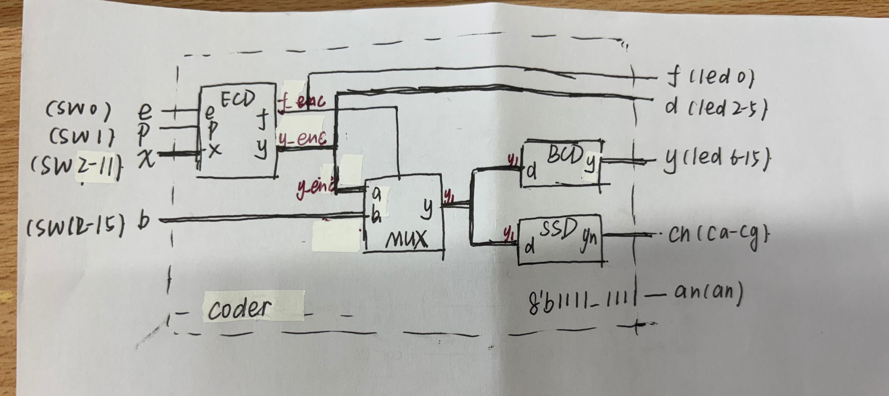
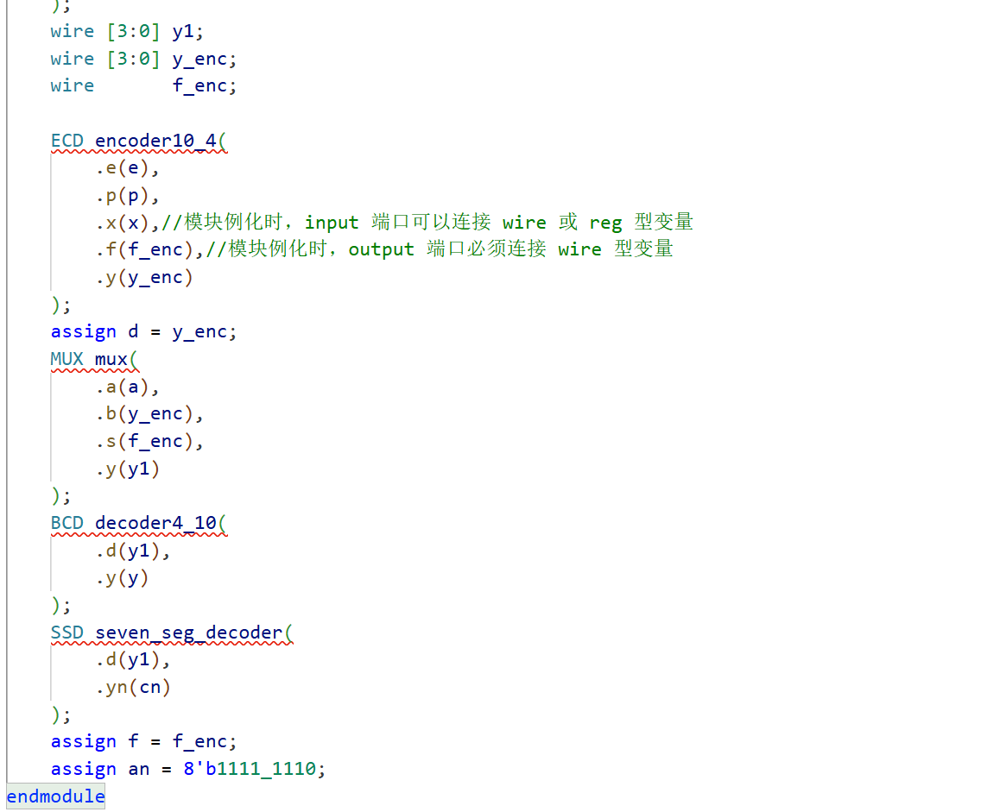
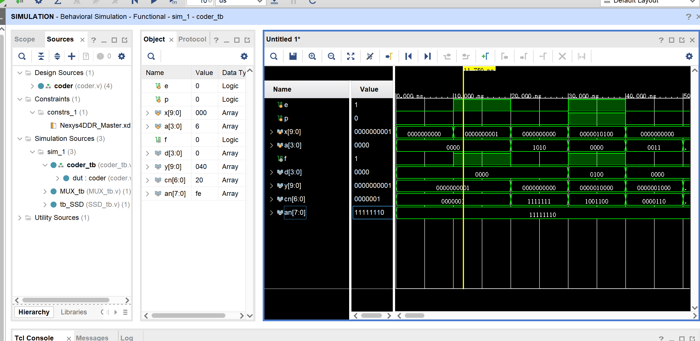
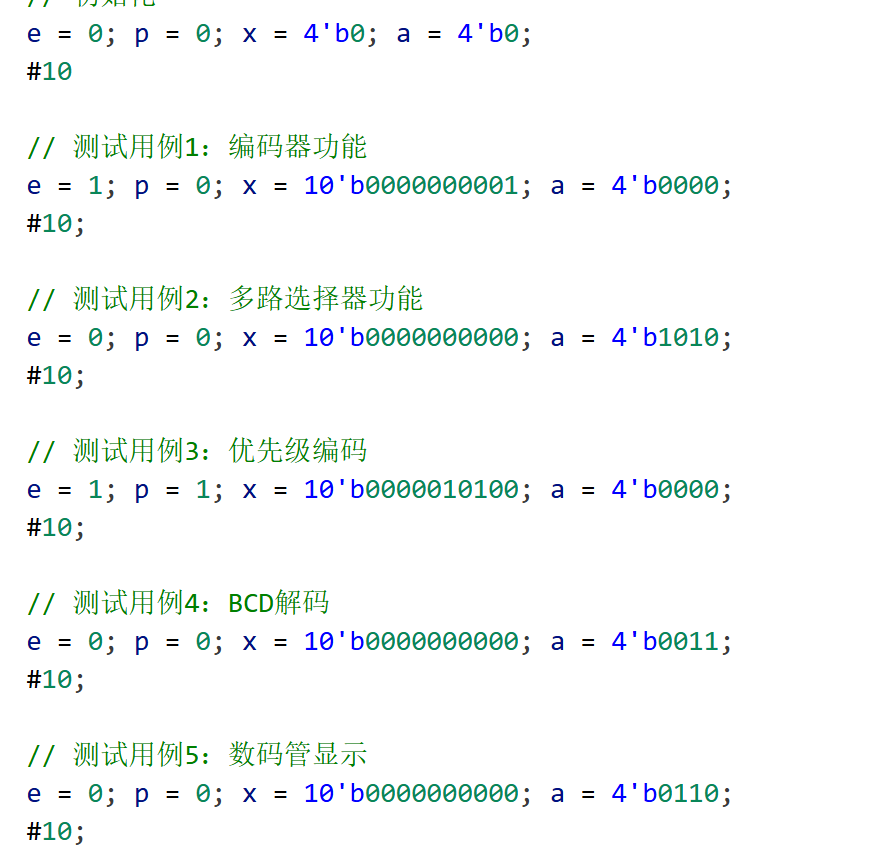
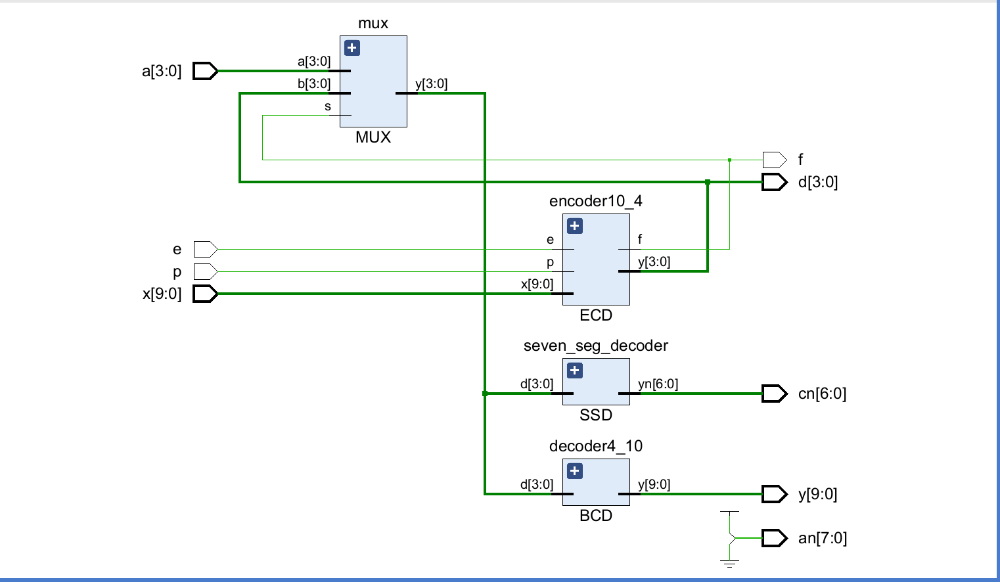
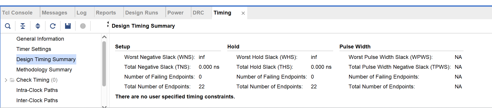
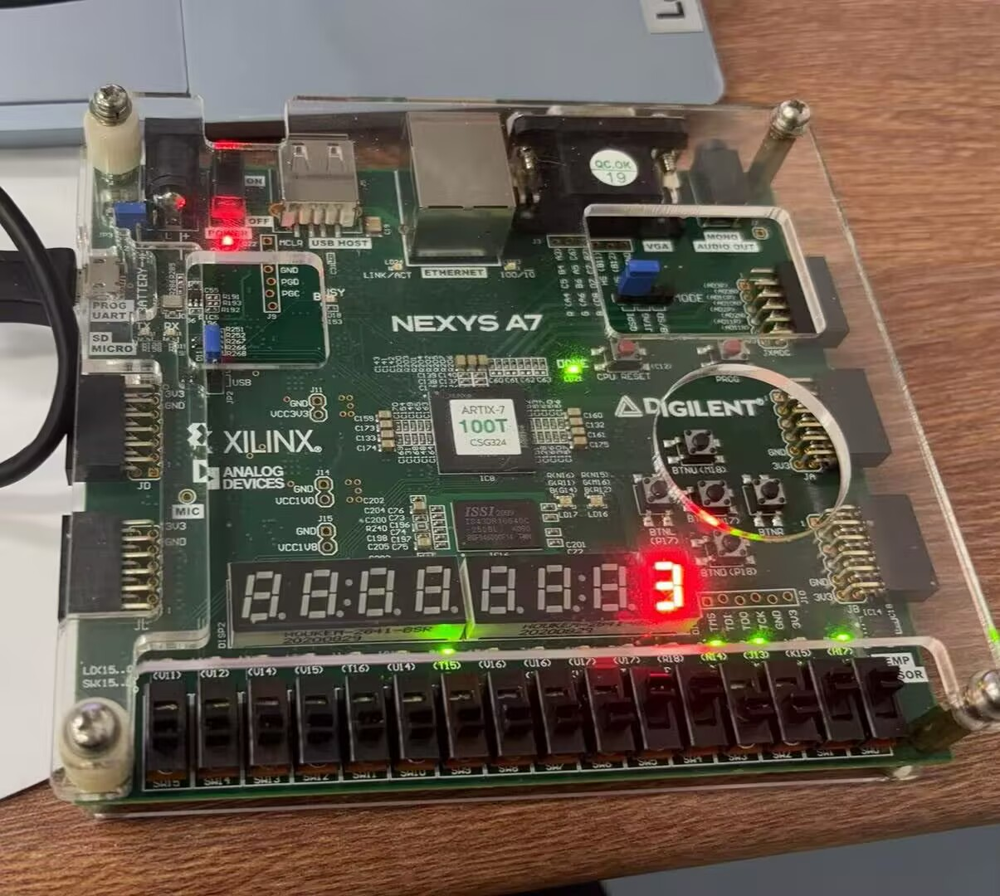

# Lab 1 report

## 实验目的与内容

1. 首先学会vivado的基本用法！！！知道一个项目的大概流程
2. 开始用verilog，尝试搞懂design sources和simulation sources的区别是什么

## 逻辑设计
1. 请参照PPT画出你设计的各模块的框图和数据通路，可以使用（在线）思维导图类软件进行绘制；

  

  
手画吧，最近好忙来不及学软件了o(╥﹏╥)o   
2. 如果存在状态机，请绘制出状态机的状态转换图   
3. 请贴出你认为较为核心的代码以及自己有两点的设计代码，并加以解释说明。 

  

  
例化模块的时候output 端口必须连接 wire 型变量，所以用了f_enc和y_enc  
(感觉没什么亮点，都是最基本的语法o(╥﹏╥)o)

## 仿真结果与分析
1. 请给出你使用的仿真文件的运行结果截图，并对结果加以阐释； 
   

  

 
把显示改成二进制后，直接看的波形图每项结果和预期结果是否一致 
2. 请贴出你编写的有特点的仿真测试文件，并说明你在编写仿真测试文件时，对各类情况的考虑（选做）。 
   

  

   
其实不太知道应该有几个测试用例  
首先均初始化为0  
e=1 p=0测试普通编码器及解码器  
e=1 p=1测试优先编码器及解码器  
e=0 测试多路选择器

## 电路设计与分析

1. 请给出完整的RTL电路图。若某模块较为复杂，也可以再给出该模块的RTL电路图； 
   

  

 
2. 查看并在此附上资源使用情况，并截图证明WNS为非负数。 
   

  

 

## 测试结果与分析

1. 请拍照并附上实验上板结果，以佐证设计的正确性 
   

  

 
2. 对实验上板结果进行简要的说明。 
   开关搞反了，e在最右端，p为右端第二个开关，图中是优先选择器，输入0000001100，输出为3 

## 总结

1. 请对本次实验中你完成的任务进行简要总结，并总结自己的收获和体验 
   最重要的是会用vivado的基本功能了！也是体验一回上板了，电脑盲还是好高兴的o(╥﹏╥)o；感觉第二个实验就变难了，希望能多撑几个实验 
2. 如果对本次实验的设计或助教、老师有建议，可以在这里写下，助教和老师会认真阅读并讨论哦！ 
   希望能再说清楚一点标准，想了好久才意识到应该要上板检查，谢谢❥(^_-) 